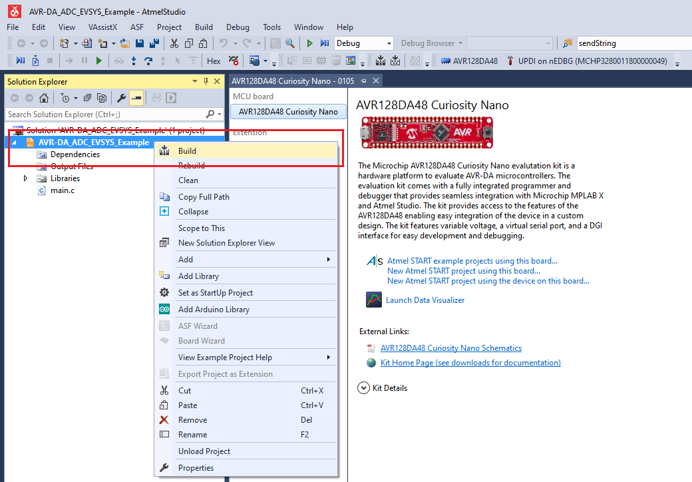
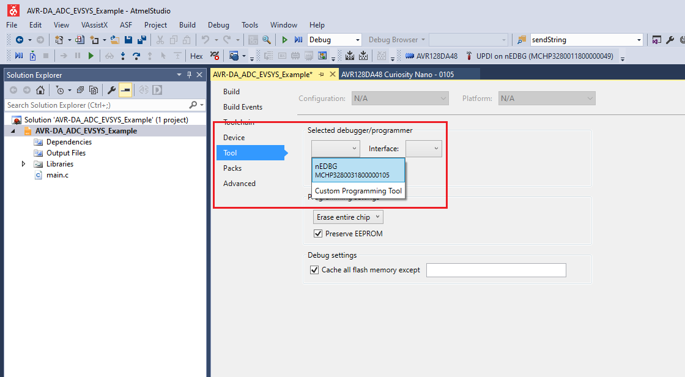
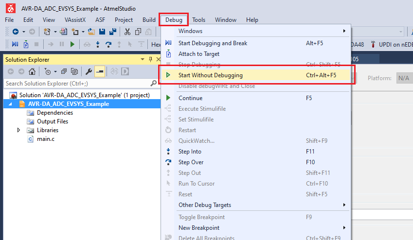

# AVR128DA48 ADC Event System Code Example

This repository provides an Atmel Studio solution with a bare metal code example for ADC triggered via Event System. Using the event system, the on-board user button state change will trigger the ADC0 to start a conversion and read the analog signal on PD0.

With this setup, when the button on the Curiosity Nano board is pressed, a single conversion of the ADC will be triggered on Analog Input 0 (PD0). An interrupt is set to be activated when the ADC conversion cycle is over. Inside the interrupt routine the conversion result is saved and the on-board user LED is toggled to visualize the end of conversion.

## Related Documentation
More details and code examples on the AVR128DA48 can be found at the following links:
- [AVR128DA48 Product Page](https://www.microchip.com/wwwproducts/en/AVR128DA28)
- [AVR128DA48 Code Examples on GitHub](https://github.com/microchip-pic-avr-examples?q=avr128da48)
- [AVR128DA48 Project Examples in START](https://start.atmel.com/#examples/AVR128DA48CuriosityNano)

## Software Used
- Atmel Studio 7.0.2397 or newer [(microchip.com/mplab/avr-support/atmel-studio-7)](https://www.microchip.com/mplab/avr-support/atmel-studio-7)
- AVR-Dx 1.0.18 or newer Device Pack

## Hardware Used
- AVR128DA48 Curiosity Nano [(DM164151)](https://www.microchip.com/Developmenttools/ProductDetails/DM164151)

## Setup
The AVR128DA48 Curiosity Nano Development Board is used as test platform
 

The following configurations must be made for this project:

- ADC0 - Configured in single conversion mode
- VREF - Reference voltage for ADC0 set to 2.048V
- EVSYS - Configure PC7 pin (SW0) as event generator on Channel 3

|Pin           | Configuration      |
| :----------: | :----------------: |
|PC6 (LED0)    | Digital Output     |
|PC7 (SW0)     | Digital Input      |
|PD0 (AIN0)    | Analog Input       |

## Operation

1. Open the *AVR-DA_ADC_EVSYS_Example.atsln* solution in Atmel Studio

2. Build the solution: right click on *AVR-DA_ADC_EVSYS_Example* solution and select Build
 

3. Select the AVR128DA48 Curiosity Nano on-board debugger in the *Tool* section of the project settings:
 - Right click on the project and click *Properties*;
 - Click *Tool* tab on the left panel, select the corresponding debugger and save the configuration (Ctrl + S)
 

4. Program the project to the board: select *AVR-DA_ADC_EVSYS_Example* project and click *Start Without Debugging*:
 

Demo:
 

## Summary
This example represents a basic implementation of using ADC via Event System. Using the event system, the button state change triggers the ADC configured in single conversion mode. An interrupt is set to be activated when the ADC conversion cycle is over.
